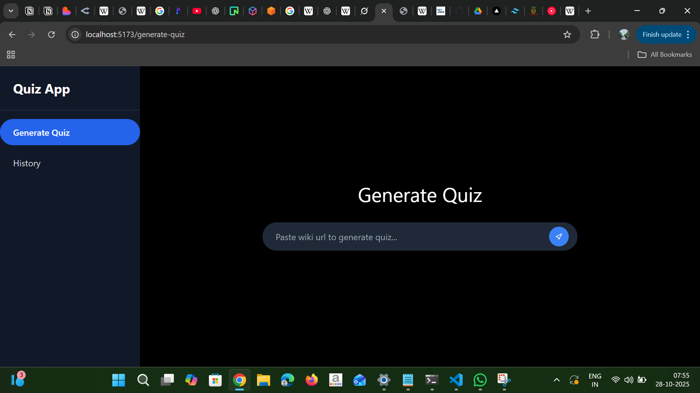
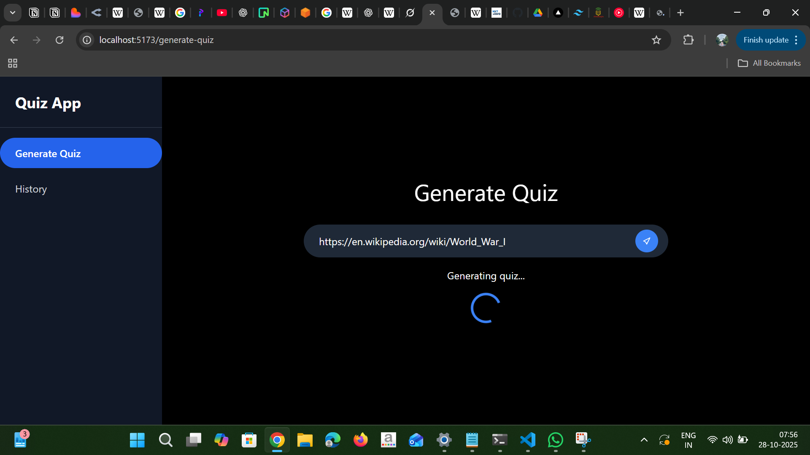
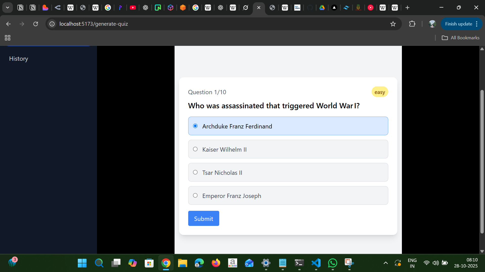
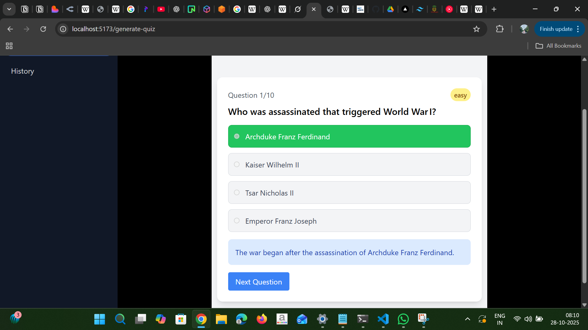
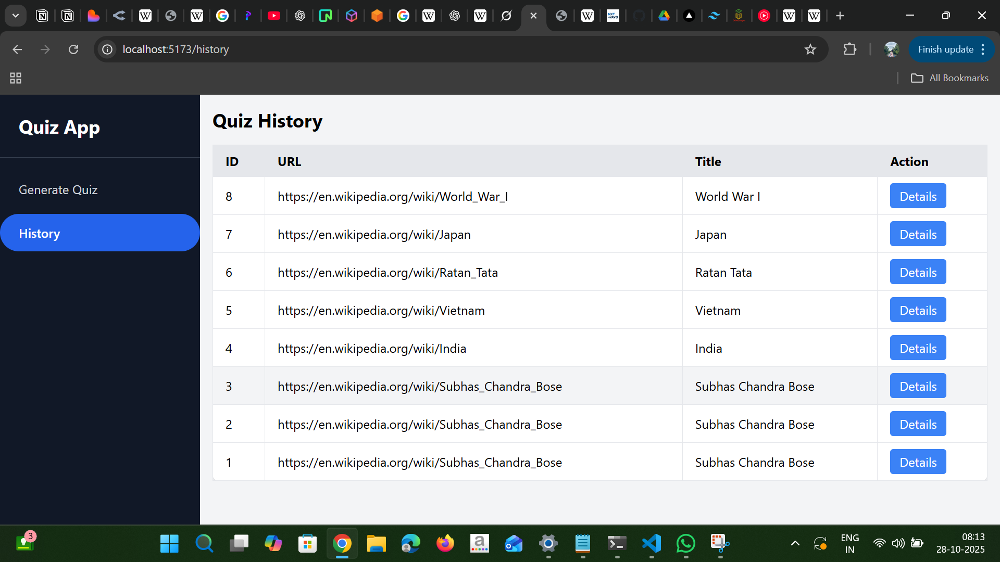

# 🧠 AI Quiz Generator

AI Quiz Generator is a full-stack application that automatically generates quizzes from text, URLs, or documents using AI.  
Built with **React.js (Vite)** for the frontend and **FastAPI** for the backend.

---

## 🚀 Features
- 📝 Generate quizzes automatically from text or URLs  
- 🧩 Displays questions with multiple-choice options  
- 💡 Shows explanations after selecting the answer  
- 🕹️ Difficulty levels (easy, medium, hard)  
- 📜 Quiz history stored in database with detailed view  
- ⚡ Fast and responsive UI with Tailwind CSS  

---

## 🖼️ Screenshots

### 🎯 Generate Quiz Page


### Loading View 


### Quiz View 





### 📚 Quiz History Page


> 📸 Place your screenshots inside a folder named `assets` in your project root.  
> Example:
> ```
> aiquizgenerator/
> ├── backend/
> ├── frontend/
> ├── assets/
> │   ├── generate-quiz.png
> │   ├── history-page.png
> ├── README.md
> ```

---

## 🧩 Tech Stack

### Frontend:
- React.js (Vite)
- Tailwind CSS
- React Router DOM

### Backend:
- FastAPI
- LangChain / OpenAI integration (for quiz generation)
- SQLAlchemy + PostgreSQL / NeonDB
- CORS middleware enabled

---

## ⚙️ Installation

### 1️⃣ Clone the repository
```bash
git clone https://github.com/<your-username>/aiquizgenerator.git
cd aiquizgenerator
